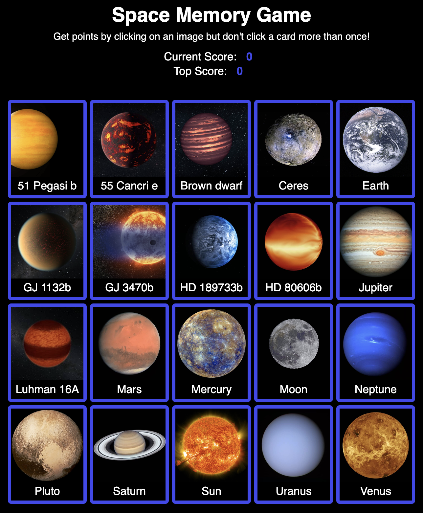

# Space Memory Card Game

## Overview

A card game testing your memory. Accumulate points by clicking on a card. But don't click a card more than once! See if you can reach 20 points!

[Live Demo](https://dukdukg00se.github.io/memory-card/)

## Learning Objectives

- Practice building with React functional components
- Using state
- Using React hooks

## Notes

This project was done as part of [The Odin Project](https://www.theodinproject.com/paths) curriculum and is the [Memory Card](https://www.theodinproject.com/lessons/node-path-javascript-memory-card) project. The goal for this project was to use hooks as well as a lot of state.

## Future Improvements

- Add levels to the game, with higher levels corresponding to an increase in deck size
- Add a loading spinner
- Add a favicon to page

## Credits

- Design inspired by and card images from [TheOnlyHamster](https://github.com/Theonlyhamstertoh/planet-cards). All logic and code is original.
